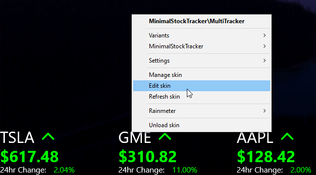
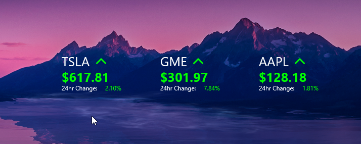
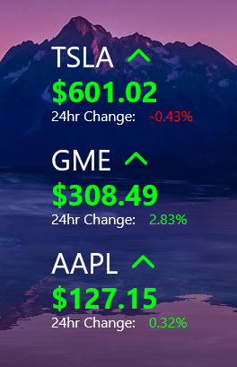

# Minimal Stock Tracker

This is a rainmeter skin currently under development. It displays the current price and 24hr change of specified stocks using the CNBC webpage. 

**Currently Under Very Early Development! Expect Issues!**

---

## **Setting the stocks you wish to track:**
This will be in the variables section and may slightly vary depending on the skin you are using a guide on how to use the variables section is [here](#Variables).

1. Single Tracker:
    
    Find the variable:
    ```ini
    StockSymbol=TSLA
    ```
    Then change the TSLA part to whatever stock symbol you with to track, for example if I wished to track Apple stock, I would change it as follows:
    ```ini
    StockSymbol=AAPL
    ```
1. MuliTrackers:
    Multitrackers can also be changed in a very similar way the only difference is the variable names are slightly different. They will look like so:
    ```ini
    StockSymbol1=TSLA
    StockSymbol2=GME
    StockSymbol3=AAPL
    ;And so on!
    ```
    The number next to StockSymbol represents its position in the list, TradeSymbol1 is the first in the list.

---
## **Variables**    

You can modify the variables by right clicking on any one of the skins and hitting the edit skin button. As shown below:



This will open up the code for the skin and may seem intimidating at first, However, to personalize the skin you only need to change items in the variables section, **DO NOT TOUCH THE REST OF THE CODE UNLESS YOU KNOW WHAT YOU'RE DOING!**

*Variables will be located under a tag that looks like this:*
```ini
[Variables]
;Variables are here!
```  

Some variables will be commented, explaining what they do, and providing the default value as a point of reference if you need to go back and change them later:
```ini
;The default colour of the text. DEFAULT VALUE: 255,255,255
TextColor=255,255,255
```

However, as I am early in the development stage these comments may not be present and if they are may be very basic, this will improve as development progresses.

---
## **Variants:**
- Single Tracker:

    

- Multi Trackers:
    * 3 Trackers
        - Horizontal
            
            

        - Vertical
            
            

